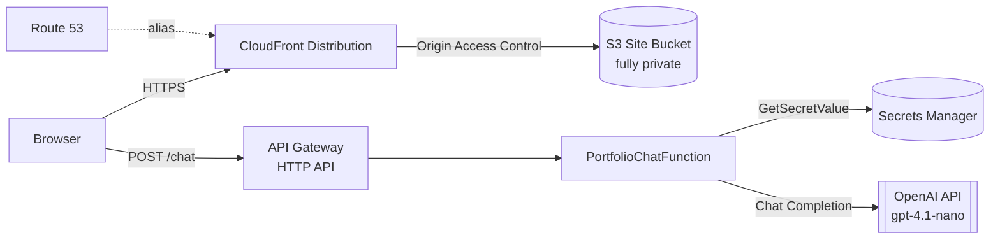

# Architecture

Technical reference for Connexus: how it's structured, how to run and deploy it, and what
tradeoffs were made deliberately. For the what-and-why at a higher level, see the root
[README](../README.md).

## Contents

- [Overview](#overview)
- [Repo structure](#repo-structure)
- [Design decisions](#design-decisions)
- [Prerequisites](#prerequisites)
- [Environment / configuration](#environment--configuration)
- [Local development](#local-development)
- [Deploying](#deploying)
- [Chat API](#chat-api)
- [Security posture](#security-posture)

---

## Overview



- **Static frontend** (React SPA) builds to `my-site-ui/dist`, is pushed to a private S3
  bucket, and is served through CloudFront.
- **Chat backend** is a separate path — the browser calls an API Gateway HTTP API directly,
  not through CloudFront. The `/chat` route invokes a Lambda, which pulls the OpenAI key from
  Secrets Manager at request time.
- **DNS**: Route 53 A-records (root + `www`) alias to the CloudFront distribution.
- No database, no auth layer today — see the root README's Status note and the project's
  roadmap doc for what's planned.

---

## Repo structure

```
my-site/
├── app.py                      # CDK app entrypoint
├── cdk.json
├── requirements.txt             # Python deps for the CDK app itself
├── my_site/
│   └── my_site_stack.py         # the one CDK stack: S3, CloudFront, Route53, API GW, Lambda
├── lambda/
│   └── portfolio_chat/
│       ├── lambda_function.py   # chat handler
│       └── requirements.txt     # Lambda deps (openai, etc.) — bundled at deploy time
├── my-site-ui/                  # React + Vite frontend
│   ├── src/
│   │   ├── components/          # Chatbot, BoM Quiz, Greek Reader
│   │   └── config.ts            # reads VITE_API_URL
│   ├── .env                     # VITE_API_URL=... (gitignored)
│   ├── package.json
│   └── vite.config.ts
└── tests/                       # currently the unmodified CDK scaffold example test
```

---

## Design decisions

Short version of *why*, not just *what* — the reasoning tends to matter more than the
mechanism once the stack changes shape.

| Decision | Why |
|---|---|
| One CDK stack, not split by concern | Started simple; now owns frontend hosting + chat backend. Worth revisiting as the app grows — not yet done. |
| Local `pip` bundling instead of Docker for Lambda deps | Docker-based CDK asset bundling previously crashed the dev machine hard enough to need a factory reset. A plain `pip install --platform manylinux2014_x86_64 --only-binary=:all:` pulls prebuilt wheels with no Docker/VM involved. Docker bundling is still configured as an automatic fallback if a future dependency lacks a manylinux wheel. |
| S3 fully private + CloudFront OAC, not public bucket + S3 website hosting | The original setup needed public access because S3 website endpoints can't work with Origin Access Control. Removing website-hosting mode entirely let the bucket go fully private. |
| Secrets Manager instead of Lambda env vars | Env vars are visible in the console/CloudFormation to anyone with read access to the Lambda config. Secrets Manager + a single-secret IAM grant keeps the key out of both the repo and the Lambda's own configuration. |
| Chat API separate from CloudFront | Keeps the CDN's cache and the API's throttling/CORS concerns independent — no risk of a static-asset cache rule accidentally affecting API responses or vice versa. |
| Three-layer rate limiting (API Gateway throttle + Lambda reserved concurrency + per-request truncation) | Each layer protects against a different failure mode — sustained abuse, concurrent burst, and per-call cost — rather than leaning on one mechanism to catch everything. |

**In progress:** the Lambda handler has an early `{"warmup": true}` short-circuit path meant to
reduce cold starts, but nothing in the stack schedules a warm-up ping yet (no EventBridge rule).
This is a known half-finished thread, not a bug — rounding it out (likely a scheduled
CloudWatch Event invoking the Lambda periodically) is planned for a future pass.

---

## Prerequisites

- An AWS account with the CLI configured (`aws configure`), and permissions to manage S3,
  CloudFront, Route 53, API Gateway, Lambda, Secrets Manager, and IAM.
- A Route 53 hosted zone already existing for your domain.
- An ACM certificate for your domain, **issued in `us-east-1`** — a hard CloudFront
  requirement regardless of which region the rest of the stack deploys to. This stack deploys
  to `us-east-2`; the cert still has to live in `us-east-1`.
- A secret in AWS Secrets Manager named `portfolio_app/api_key` containing a JSON body of the
  form `{"OPENAI_API_KEY": "sk-..."}`.
- Node.js 20+ and npm.
- Python 3.11+ and a virtualenv, for the CDK app.
- The AWS CDK CLI: `npm install -g aws-cdk`.

Before the first deploy in a fresh account/region, bootstrap CDK once:

```bash
cdk bootstrap aws://<AWS_ACCOUNT_ID>/us-east-2
```

`app.py` pins the deploy target to a specific account/region:

```python
env=cdk.Environment(account="<AWS_ACCOUNT_ID>", region="us-east-2"),
```

and `my_site_stack.py` imports the ACM cert by ARN:

```python
acm.Certificate.from_certificate_arn(
    self, "SiteCert", "arn:aws:acm:us-east-1:<AWS_ACCOUNT_ID>:certificate/<CERT_ID>"
)
```

Swap in your own account ID, cert ARN, and domain names (`domain_names` in `my_site_stack.py`,
plus the Route 53 records) if adapting this stack for a different site.

---

## Environment / configuration

| What | Where | Committed? |
|---|---|---|
| Chat API URL (`VITE_API_URL`) | `my-site-ui/.env` | No — gitignored |
| OpenAI API key | AWS Secrets Manager (`portfolio_app/api_key`) | Never touches the repo |

`my-site-ui/.env`:

```dotenv
VITE_API_URL=<url>
```

`VITE_API_URL` is the full chat endpoint — the value CDK prints as `ChatApiUrl` after a
deploy (`https://<api-id>.execute-api.us-east-2.amazonaws.com/chat`).

> **Gotcha:** Vite only reads `.env` at *build* time. Changing `VITE_API_URL` requires running
> `npm run build` again before the next `cdk deploy`, or the old value stays baked into the
> JS bundle already sitting in S3.

The OpenAI key is fetched from Secrets Manager via `boto3` on every Lambda invocation. The
Lambda's IAM policy grants `GetSecretValue` on that one secret ARN only.

---

## Local development

There's no local emulation of the Lambda/API Gateway backend today — the frontend dev server
talks to whatever `VITE_API_URL` points at (typically the live, deployed chat API).

```bash
cd my-site-ui
npm install
npm run dev
```

---

## Deploying

```bash
# 1. Python deps for the CDK app (one-time / on requirements.txt changes)
python -m venv .venv && source .venv/bin/activate
pip install -r requirements.txt

# 2. Build the frontend — must happen BEFORE cdk deploy.
#    cdk deploy does NOT build the frontend for you.
cd my-site-ui
npm install
npm run build
cd ..

# 3. Deploy everything (site, CDN, DNS, chat API, Lambda)
cdk deploy
```

Deploys are currently fully manual — there's no CI/CD pipeline yet.

---

## Chat API

**`POST {VITE_API_URL}`** — CORS locked to the production domains.

Request body:

```json
{ "message": "What's Noah's experience with AWS?" }
```

- `message` is truncated to 2000 characters server-side before being sent to OpenAI.
- A `{"warmup": true}` body short-circuits before calling OpenAI and returns
  `{"status": "warm"}` (see the cold-start note under [Design decisions](#design-decisions)).

Response (200):

```json
{ "reply": "..." }
```

Response (500, on any internal error):

```json
{ "error": "..." }
```

### Rate limiting / cost controls

1. **API Gateway throttling** — 5 req/s sustained, burst 10.
2. **Lambda reserved concurrency** — hard ceiling of 5 simultaneous executions.
3. **Per-request caps in `lambda_function.py`** — input truncated to 2000 chars,
   `max_tokens=400` on the OpenAI completion.

Per-IP rate limiting via AWS WAF was deliberately deferred — added ongoing cost, not judged
necessary yet at this traffic level.

---

## Security posture

- **Secrets**: OpenAI key lives only in Secrets Manager, fetched at request time,
  least-privilege IAM grant scoped to the single secret ARN.
- **S3**: fully private (`BLOCK_ALL`), reachable only via CloudFront + Origin Access Control.
- **CORS**: restricted to the production domains only.
- **IAM**: every role in the stack has been reviewed against synthesized CloudFormation. One
  accepted, low-risk finding: the `BucketDeployment` construct's own Lambda role gets
  `cloudfront:CreateInvalidation` scoped to `Resource: "*"` — a limitation of that CDK L2
  construct itself, not something exposed through props. Left as-is; blast radius is
  invalidation only (no read/write/delete of data).
